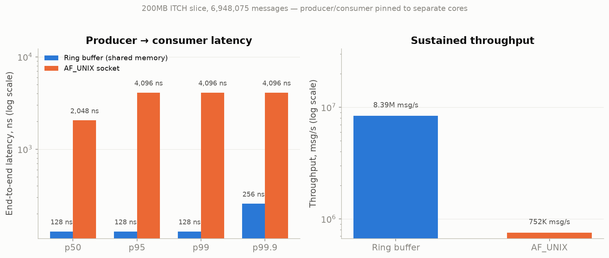
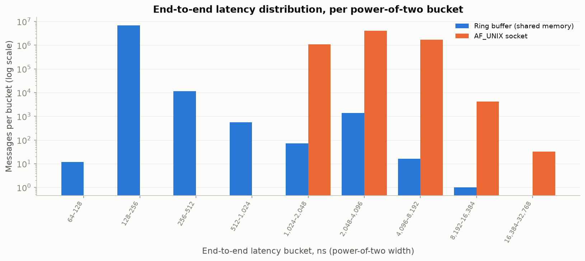

# Low-Latency Feed Handler

A C++20 market-data feed handler: ingest a raw NASDAQ ITCH 5.0 feed (mmap'd
file or live UDP replay), parse and normalize each message into a fixed
64-byte struct, and publish it to a separate consumer process. The core of
the project is comparing two IPC transports for that hand-off — a lock-free
SPSC ring buffer in shared memory vs. an `AF_UNIX` socket — on end-to-end
latency and throughput.

## Design overview

- **Ingestion** (`src/ingest_source.hpp`, `ingest_mmap.hpp`, `ingest_socket.hpp`) —
  a common `IngestSource` interface over two modes: file mode `mmap`s the
  `.itch` file directly (zero-copy, no network involved), and socket mode
  reads MoldUDP64-framed UDP datagrams (NASDAQ's real batching protocol). A
  `replay` tool re-emits a file over UDP so socket mode can be exercised
  end-to-end, either at max rate or paced to the original inter-message gaps.
  Both sources drop malformed input instead of handing it on: records
  shorter than their message type's wire size, and (over UDP) lengths or
  message counts that run past the datagram, plus sequence numbers already
  delivered. A missing or unreadable data file is an error, not an empty feed.
- **Dispatch & handlers** (`src/dispatch.hpp`, `handlers.hpp`) — a `switch` on
  the message-type byte routes each record to a handler that byte-swaps the
  packed wire struct into a normalized message, returned by value.
- **Normalization** (`src/normalise.hpp`) — the order-book-relevant message
  types (`S R A F E C X D U P`) collapse into one fixed-size, 64-byte,
  trivially-copyable `NormalisedMessage` (one cache line), so it can be pushed
  straight into a shared-memory ring buffer or written raw over a socket with
  no serialization step. Other types are dropped. Order Replace (`U`) carries
  both the new and the original order reference.
- **IPC bus** (`src/spsc-ring-buffer.hpp`, `ipc/`) — `producer_main` ingests
  and dispatches like a normal feed handler, then publishes each
  `NormalisedMessage` to a standalone `consumer_main` over one of two
  transports, chosen at compile time: a shared-memory SPSC ring buffer
  (acquire/release atomics, no syscalls), or an `AF_UNIX SOCK_SEQPACKET`
  socket (the baseline — a syscall plus a kernel-mediated copy per message).
  The ring's shared-memory segment (owner-only, `0600`) has a small handshake:
  the producer publishes nothing until a consumer has claimed the ring, a
  consumer ignores segments left behind by a dead producer, and either side
  notices if its peer dies instead of waiting forever. A consumer whose
  stream ends without the producer's end marker exits non-zero, since its
  results are partial.
- **Latency measurement** (`src/latency_histogram.hpp`) — a zero-allocation,
  power-of-two-bucketed histogram, fed `rdtsc` cycles for in-process
  parse/dispatch latency and `CLOCK_MONOTONIC` nanoseconds for cross-process
  end-to-end IPC latency.

## Build

```bash
cmake -S . -B build
cmake --build build -j
```

Produces `feed_handler` (in-process ingest+dispatch, no IPC — a diagnostic
tool), `ipc_producer_ring`/`ipc_consumer_ring`, `ipc_producer_unix`/
`ipc_consumer_unix`, and `replay`. All default to file mode; pass
`--udp=PORT` to switch to socket mode (fed by `replay`) with no rebuild:

```bash
./build/ipc_consumer_ring [histogram.csv] &   # launch order doesn't matter
./build/ipc_producer_ring                     # file mode; waits for the consumer
```

(swap `_ring` for `_unix` for the socket baseline).

## Tests

```bash
tests/run_tests.sh
```

Builds everything with plain `g++` into `build/tests/` (no CMake or data
download needed) and runs the whole suite; exits non-zero if any test fails.

- `tests/test_parsing.cpp`: CLI args, ITCH struct layout, handlers and
  dispatch, MoldUDP64 framing, and the mmap and UDP ingestion sources.
- `tests/test_core.cpp`: the SPSC ring (including a two-thread ordering
  stress test), the latency histogram, and the timers.
- `tests/test_transports.cpp`: both IPC transports across real processes.
  Covers the happy path in both launch orders, a peer dying, stale or
  garbage shared-memory segments, two consumers competing for one ring,
  and cleanup on scope exit.
- `tests/integration_test.py`: drives the built binaries end to end on
  synthetic ITCH data. Covers `feed_handler`, `replay` framing and pacing,
  the producer/consumer pairs, killing either side mid-stream, bad inputs,
  `bench/run_ipc_comparison.sh` (run from a throwaway copy with `cmake`
  stubbed out, so it never writes to `bench/results/`), and build checks
  (standalone headers, multi-TU linking, no warnings).

The parsing and core tests also run under ASan/UBSan. Each C++ test runs in
its own forked process with a deadline, so a crash or hang shows up as a
failed test rather than stopping the run. The suite uses the same shared-memory
and socket names as the benchmark, so don't run the two at the same time.

## Benchmarking

Run `bash download_data.sh` first to fetch the NASDAQ sample feed into `data/`.

### Standard benchmark

The standard benchmark runs the producer and consumer on two fully isolated
CPUs on different physical cores. It needs root, and isolation comes in two
parts: kernel boot parameters (set up once, step 1) and runtime settings that
`bench/run_ipc_isolated.sh` applies and undoes around every run (step 2).

#### Step 1: one-time boot setup

Pick two CPUs on different physical cores: not SMT siblings of each other
(check `/sys/devices/system/cpu/cpu<N>/topology/thread_siblings_list`). The
examples below use 12 and 14, the two highest physical cores on a 16-CPU
machine with paired hyperthreads.

| Kernel parameter | What it removes from the isolated CPUs |
|---|---|
| `isolcpus=domain,managed_irq,<cpus>` | Every other task, by excluding the CPUs from scheduling; and kernel-managed IRQs (e.g. NVMe and network queues) |
| `nohz_full=<cpus>` | The periodic scheduler tick (250–1000 interrupts/s) while a single task runs |
| `rcu_nocbs=<cpus>` | RCU callback processing, offloaded to kthreads on the other CPUs |

`nohz_full` adds about 130ns to every syscall on those CPUs (measured on the
benchmark machine), which the socket transport pays on each `send()` and `recv()`.

1. Append the parameters to `GRUB_CMDLINE_LINUX_DEFAULT` in `/etc/default/grub`:
   ```
   GRUB_CMDLINE_LINUX_DEFAULT="quiet splash isolcpus=domain,managed_irq,12,14 nohz_full=12,14 rcu_nocbs=12,14"
   ```
2. Regenerate the GRUB config and reboot:
   ```bash
   sudo update-grub      # Fedora/RHEL: sudo grub2-mkconfig -o /boot/grub2/grub.cfg
   sudo reboot
   ```
3. Check that they took effect:
   ```bash
   cat /sys/devices/system/cpu/isolated    # should print 12,14
   cat /sys/devices/system/cpu/nohz_full   # should print 12,14
   ```

The kernel needs `CONFIG_NO_HZ_FULL` and `CONFIG_RCU_NOCB_CPU` (check
`/boot/config-$(uname -r)`); stock Ubuntu kernels have both. The isolated CPUs
stay reserved until you remove the parameters, rerun `update-grub` and reboot.

#### Step 2: run the benchmark

```bash
sudo bash bench/run_ipc_isolated.sh
```

The script first checks the step 1 parameters are active for its CPUs and
stops with the exact line to add if not. It runs the producer on the higher of
the two isolated CPUs and the consumer on the lower; pass
`PRODUCER_CPU CONSUMER_CPU` to choose. Around the run it:
- takes the CPUs' SMT siblings offline, so nothing shares their cores;
- moves the remaining IRQs, unbound workqueues, and the lockup watchdog to the
  other CPUs, pausing `irqbalance` if it's running;
- disables idle states on the two CPUs and pins them to maximum frequency.

Afterwards it restores every setting it changed, even if the benchmark fails.
To apply or undo the runtime settings by hand (e.g. for repeated runs), use
`sudo bash bench/isolate_cores.sh [PRODUCER CONSUMER]` and
`sudo bash bench/isolate_cleanup.sh`.

Results are written to `bench/results/ipc_summary.csv` plus per-bucket histograms.

### Baseline benchmark (no isolation)

For comparison or on systems where root is unavailable:

```bash
bash bench/run_ipc_comparison.sh
```

This pins producer/consumer to two different physical cores via `taskset`
but leaves the rest of the system untouched, so results include scheduler,
interrupt, and frequency-scaling noise.

### Visualization

The plotting notebook runs in a virtualenv at `bench/.venv` (gitignored).
Create it once:

```bash
python3 -m venv bench/.venv
bench/.venv/bin/pip install nbconvert ipykernel matplotlib pandas
```

Then regenerate the plots in `bench/plots/` from the benchmark results (the
executed copy of the notebook goes to a temp dir, keeping the committed one
free of outputs):

```bash
bench/.venv/bin/jupyter nbconvert --to notebook --execute --output-dir "$(mktemp -d)" bench/benchmark_plots.ipynb
```

## Results

Benchmark: 200MB ITCH slice, 6,948,075 messages published end-to-end.
Published and received counts matched exactly — neither transport drops messages.
Producer and consumer run on two different physical cores.

### Latency and throughput



Latencies are reported as the lower edge of their power-of-two histogram
bucket, so 128ns means 128–255ns.

| | Ring buffer | AF_UNIX socket | Ring buffer advantage |
|---|---:|---:|---:|
| p50 | 128ns | 2,048ns | 16× |
| p95 | 128ns | 4,096ns | 32× |
| p99 | 128ns | 4,096ns | 32× |
| p99.9 | 256ns | 4,096ns | 16× |
| Throughput | 8.39M msg/s | 752K msg/s | 11× |

This tracks the transport design: the ring buffer path is one shared-memory
write with no syscall, while the socket path incurs a `send()`/`recv()`
syscall pair and two kernel-mediated copies per message.

### Full latency distribution



The full distribution shows the same gap: 99.8% of ring-buffer messages land
in the 128–256ns bucket, while the socket path has nothing below 1,024ns and
99.9% of its mass in 1,024–8,192ns.
